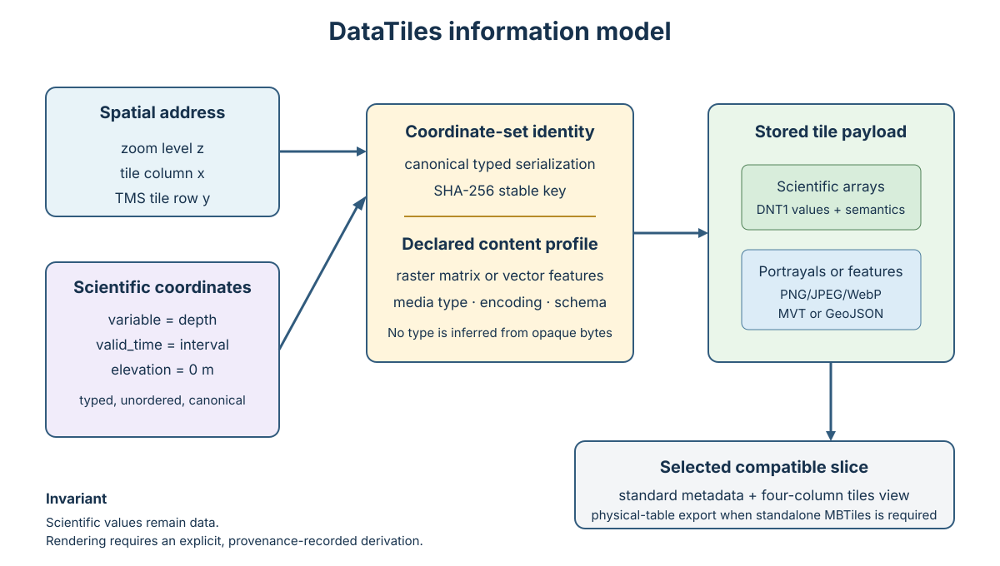

# DataTiles

**DataTiles is MBTiles for multidimensional data: an SQLite container that stores both raster matrices and vector feature tiles.** It is inspired by the Data Tiles/Diles research model and extends [MBTiles 1.3](https://github.com/mapbox/mbtiles-spec/blob/master/1.3/spec.md). A tile is addressed by the conventional spatial coordinate `(z, x, y)` plus an arbitrary typed set of scientific coordinates such as valid time, elevation, pressure level, ensemble member, model run, scenario, variable, or band.

The format keeps the required MBTiles `metadata` and four-column `tiles` interfaces. `tiles` is a view exposing one selected multidimensional slice, so an ordinary MBTiles reader can consume a coherent raster or vector slice without understanding the extension. For conservative OpenLayers/MBTiles adapters, `export-mbtiles` materializes that slice into a standalone file with physical standard tables and no extension objects. DataTiles-aware readers can discover every slice, its typed coordinates, raster/vector content type, IETF media type, encoding, schema, CRS, and provenance.



*Figure 1. A spatial MBTiles address and an unordered canonical set of typed scientific coordinates resolve to an explicitly declared payload. Only a compatible selected slice is projected through the conventional MBTiles interface; scientific arrays are not silently presented as imagery.*

## Coordinate model

```text
tile = (z, x, y, {dimension-name: typed-point-or-interval, ...})
       -> (raster | vector, media-type, encoding, schema, BLOB)
```

Dimension order is immaterial. Coordinate sets are canonicalized and shared between tiles. Values are typed and searchable; no JSON parsing is required in the tile lookup path.

## Quick start

```bash
python -m pip install -e .
datatiles init weather.datatiles --name "WRF forecast" --format png
datatiles add-dimension weather.datatiles valid_time datetime --axis T --extent interval
datatiles add-dimension weather.datatiles pressure float --unit hPa --axis Z
datatiles add-crs weather.datatiles horizontal --authority EPSG --code 3857 \
  --uri http://www.opengis.net/def/crs/EPSG/0/3857
datatiles put weather.datatiles 5 17 12 tile.png \
  --coord 'valid_time=[2026-08-26T12:00:00Z,2026-08-26T18:00:00Z)' --coord pressure=850
datatiles select weather.datatiles \
  --coord 'valid_time=[2026-08-26T12:00:00Z,2026-08-26T18:00:00Z)' --coord pressure=850
datatiles validate weather.datatiles
datatiles-serve weather.datatiles --port 8080
```

The spatial row follows MBTiles/TMS convention. Use `--xyz` on `put` and `get` to convert an XYZ row.

Version 0.10 adds conservative physical-table MBTiles fallback, a self-sufficient implementation specification, and an onboard edge-intelligence manifesto/white paper. It also includes mixed raster/vector content profiles, a tested five-lesson zero-to-hero curriculum, FAIR-by-design publication profile, OpenLayers scientific playground, comprehensive quality suite, protected CI/CD release path, interval axes, PROV-inspired provenance, scientific CRS records, bounded numeric-array decoding, OpenAPI description, and read-only OGC-style access.

## NetCDF, GRIB, and Zarr import utilities

Optional import utilities under `utils/` convert local or URL-identified NetCDF, GRIB2, and Zarr rectilinear grids into semantic DNT1 DataTiles. They preserve CF Standard Names when present, add GRIB2 crosswalk identifiers when available, retain source identity plus format-appropriate checksum provenance, and never pre-render scientific arrays as imagery. Install with `python -m pip install -e '.[utils]'`; see `docs/import-utilities.md`.

Dependency-free `geojson2datatiles`, `csv2datatiles`, `xml2datatiles`, `gpx2datatiles`, and `ndjson2datatiles` utilities convert feature sources to tiled GeoJSON while validating coordinates and recording the immutable source checksum and import provenance. The bundled `resources/ports.json` collection is an explicit, unofficial demonstration input and MUST NOT be treated as an authoritative port or navigation dataset.

## Raster and vector content

- Numeric raster matrices use the dependency-free DNT1 encoding and retain dtype, shape, byte order, nodata, scale, offset, unit, and compression.
- Raster portrayals may use PNG, JPEG, WebP, or another declared media type.
- Vector feature tiles may use gzip-compressed Mapbox Vector Tile with MBTiles `vector_layers` metadata, tiled GeoJSON, or another explicitly declared vector encoding.
- Different multidimensional coordinate sets in the same file may use different content types and encodings.
- Selecting a slice updates standard MBTiles `format` and MVT `json` metadata transactionally.

See [multidimensional vector tiles](docs/vector-tiles.md) and the normative [content-profile specification](docs/specification.md#8-content-profiles).

## MBTiles fallback

Select a PNG/JPEG/WebP portrayal or gzip MVT slice, then export it for an OpenLayers stack that understands MBTiles but not DataTiles:

```bash
datatiles select ocean.datatiles --coord variable=seabed_portrayal
datatiles export-mbtiles ocean.datatiles ocean.mbtiles
```

The exporter preserves TMS rows and BLOB bytes and creates physical `metadata` and `tiles` tables. DNT1 numeric arrays are never dishonestly relabeled as pictures: create a documented, provenance-linked portrayal first. See the [fallback contract](docs/mbtiles-fallback.md).

## From Gaeta to Maratea reference demo

[`demo/from-gaeta-to-maratea`](demo/from-gaeta-to-maratea) provides the fully locked “From Gaeta to Maratea” production workflow over `12.85–15.71851° E, 39.99852–41.21408° N`. The widened western extent includes Palmarola, Ponza, Zannone, Ventotene, and Santo Stefano. It applies finest-finite JammeGaia22 bathymetry with EMODnet DTM 2024 fallback, then applies the independently acquired GSHHG 2.3.7 full-resolution land mask. It retains categorical source coverage, integrates EMODnet Geology substrate, EUSeaMap habitats, and stored OpenStreetMap seamark vectors, and produces an immutable evidence bundle. The playground is a verification client for those results, not the production process itself.

The playground proves that DataTiles contains queryable multidimensional data rather than a pyramid of finished pictures. It offers independent depth-color, seabed-classification, shadow-relief, isoline, smart-depth-sample, and stored-nautical-vector layers; all depth products are derived from coincident DNT1 arrays, while OpenStreetMap seamark features are explicitly stored as tiled GeoJSON. Run the server and open `/playground`.

The release workspace may also contain `dist/from-gaeta-to-maratea.datatiles` and `dist/from-gaeta-to-maratea-static.zip`. The ZIP is a Safari-compatible static distribution with the complete DataTiles container, a checksum-identified 128 × 72 numeric/categorical browser surface embedded in the generated HTML, stored nautical vectors, and pinned OpenLayers assets. After extraction, `index.html` works directly through `file://`; `open-demo.command` remains available for testing through a loopback static server. Depth and seabed portrayal, shadow relief, adaptive contours, smart depth labels, source coverage, profiles, cursor inspection, the north-west shelter predicate, highlighted compound queries, and the rotatable 3D mesh are computed client-side. It includes no pre-rendered image tiles.

Repository guidance is in [`AGENTS.md`](AGENTS.md), and the Markdown license notice is in [`LICENSE.md`](LICENSE.md). The complete Apache-2.0 legal text remains in `LICENSE`.

## Zarr source ingestion

DataTiles 0.13 adds `utils/zarr2datatiles.py` for Zarr v2/v3 stores. Local directory stores use the canonical `zarr-tree-sha256-v1` store digest; remote stores must be bound to an immutable snapshot with an authoritative checksum. Groups, consolidated metadata policy, fsspec storage backends, CF semantic mapping, explicit source/output rights, and credential-safe provenance are documented in `docs/zarr-source-profile.md`.

## Optional cryptographic integrity and signatures

DataTiles schema revision 6 can cryptographically bind the final logical scientific object to a signer without making signatures mandatory. `datatiles-integrity` creates deterministic SHA-256 logical manifests and optional Ed25519 signatures, either embedded or detached. Verification explicitly distinguishes mathematical validity from trust in the signer: an embedded public key is not, by itself, an authenticated publisher identity. The dependency-free core remains unchanged; install `.[integrity]` only when signing/verification is required. See `docs/digital-signatures.md`.

## FAIR scientific publication

DataTiles 0.12 treats FAIR, provenance, and licensing as enforceable publication evidence. Published objects separate persistent identity, DataCite 4.7 citation metadata, W3C PROV-aligned lineage, SPDX rights for the generated dataset/metadata and each source, cryptographic source identity, and external repository evidence. `fair_report(strict_publication=True)` is a release gate; it does not claim that FAIRness proves scientific validity or navigational fitness. See `docs/fair-publication-profile.md`, `docs/provenance.md`, and `docs/data-licensing.md`.

## Quality assurance and releases

Pull requests run the complete suite on Python 3.10–3.13, validate playground JavaScript, build and install the distributions, and repeat the deterministic scientific-fixture build. Version tags additionally produce checksums, a GitHub build-provenance attestation, a GitHub Release, and—after the protected environment gate—a PyPI Trusted Publishing deployment. See [`docs/testing-and-release.md`](docs/testing-and-release.md) for the local protocol and repository configuration.

```bash
python -m pip install -e '.[demo]'
cd demo/from-gaeta-to-maratea
make all
```

The demo and source products are for research and visualization only and must not be used for navigation.

After building the Gaeta-to-Maratea artifact, start its server and open the numeric transect demo:

```bash
datatiles-serve work/gaeta-to-maratea.datatiles --port 8080
# Open http://127.0.0.1:8080/playground
```

The user supplies two longitude/latitude points. DataTiles resolves the depth and classification coordinate sets, decodes the corresponding numeric DNT1 tiles, samples the great-circle transect, and renders the resulting depth profile with seabed-class colors. JSON, CSV, and SVG representations are computed from the same samples.

An offline SVG can be produced without the HTTP service:

```bash
datatiles-profile work/gaeta-to-maratea.datatiles \
  14.190,40.810 14.235,40.555 --samples 256 \
  --format svg --output depth-profile.svg
```

See the [documentation index](docs/README.md), especially the normative [specification](docs/specification.md), [FAIR-by-design profile](docs/fair-by-design.md), exact [reproducibility protocol](docs/reproducibility.md), and independent-dataset [replicability protocol](docs/replicability.md).

The [onboard intelligence white paper](docs/white-paper.md) presents DataTiles as an offline-first evidence substrate for marine and automotive data-driven AI. It covers feature contracts, uncertainty, provenance, fallback, cybersecurity, human authority, environmental protection, and a practical assurance lifecycle. DataTiles itself is not an approved nautical chart, ECDIS, automated-driving function, or certified safety component.

New users can follow the [ten-lesson DataTiles zero-to-hero tutorial](docs/tutorial/README.md), which combines formal discussion with a fully offline mixed raster/vector laboratory dataset and advanced FAIR, integrity, protected-distribution, and Store exercises.

## Data acknowledgement and citation — required reading

Data Tiles demo derivatives are multi-source scientific products. Every map, MBTiles file, figure, service, paper, and release must visibly credit every dataset that actually contributed cells or features and must ship its machine-readable provenance. The Apache-2.0 software licence does not relicense any input data.
The authoritative, source-by-source register is docs/data_sources_and_citation.md. It gives full bibliographic citations, mandatory map acknowledgements, licences, persistent identifiers, coverage/resolution limitations, frozen-manifest locations, and a FAIR release checklist.

For the current From Gaeta to Maratea production build, acknowledge:

JammeGaia22/MGDS bathymetry: Foglini, F., Tonielli, R., & Rovere, M. (2024), Multi-Resolution bathymetry grids of the Naples and Pozzuoli Gulf and Amalfi Coastal Area, Jamme_Gaia22 (2022), https://doi.org/10.60521/331667, CC BY 4.0.
EMODnet fallback bathymetry: EMODnet Bathymetry Consortium (2024), EMODnet Digital Bathymetry (DTM 2024), https://doi.org/10.12770/cf51df64-56f9-4a99-b1aa-36b8d7b743a1, CC BY 4.0. EMODnet is used only where JammeGaia22 contains no finite measurement.
Land/coastline: GSHHG 2.3.7 (Wessel & Smith, 1996, https://doi.org/10.1029/96JB00104) and, when enabled, S2Coast-2023 (Duan et al., https://doi.org/10.5281/zenodo.17092775, CC BY 4.0). These remain separate topology and high-water-line facts.
Navigation and land context: © OpenStreetMap contributors, ODbL 1.0, https://www.openstreetmap.org/copyright.
The required short-form map credit is:

Bathymetry: Foglini, Tonielli & Rovere (2024), JammeGaia22/MGDS, doi:10.60521/331667; EMODnet Bathymetry Consortium DTM 2024, doi:10.12770/cf51df64-56f9-4a99-b1aa-36b8d7b743a1. Land/coastline: GSHHG 2.3.7 and S2Coast-2023. Context: © OpenStreetMap contributors, ODbL 1.0. Not for navigation.
Do not list GMRT, GEBCO, EMODnet thematic products, or ISPRA as contributors unless the specific run manifest proves that they were used. Citation is source-specific evidence, not a generic project boilerplate.

## How to cite DataTiles

Research using the software SHOULD cite the released software described by [`CITATION.cff`](CITATION.cff). Also cite the paper(s) that support the part of the scientific lineage or application you use:

- For reproducible Internet of Floating Things workflows: R. Montella et al., “Workflow-based automatic processing for Internet of Floating Things crowdsourced data,” *Future Generation Computer Systems* 94 (2019), 103–119 ([publisher record](https://www.sciencedirect.com/science/article/abs/pii/S0167739X18307672)).
- For the project's historical lineage toward elastic cloud storage and processing of multidimensional environmental data, later reflected in cloud-oriented formats such as Zarr: R. Montella and I. Foster, “Using Hybrid Grid/Cloud Computing Technologies for Environmental Data Elastic Storage, Processing, and Provisioning,” in *Handbook of Cloud Computing*, pp. 595–618, 2010, [doi:10.1007/978-1-4419-6524-0_26](https://doi.org/10.1007/978-1-4419-6524-0_26). This is a DataTiles contextual lineage statement, not a claim attributed to the publisher record.
- For onboard marine acquisition and edge/cloud crowdsourcing: R. Montella, S. Kosta, and I. Foster, “DYNAMO: Distributed leisure yacht-carried sensor-network for atmosphere and marine data crowdsourcing applications,” IC2E 2018, 333–339, [doi:10.1109/IC2E.2018.00064](https://doi.org/10.1109/IC2E.2018.00064).
- For crowdsourced bathymetry in coastal environmental modeling: D. Di Luccio et al., “Coastal marine data crowdsourcing using the Internet of Floating Things: Improving the results of a water quality model,” *IEEE Access* 8 (2020), 101209–101223, [doi:10.1109/ACCESS.2020.2996778](https://doi.org/10.1109/ACCESS.2020.2996778).

These papers establish relevant scientific lineage and application context; they do not specify the current DataTiles 1.0-draft SQLite format. See the complete [references](docs/references.md).

## Status

This repository is a working reference implementation and a draft format specification, not yet a registered standard. The on-disk application identifier and extension metadata make the dialect detectable without preventing normal SQLite access.

## License

Apache-2.0.

## Optional commercial DRM

DataTiles can optionally package a finalized lawful commercial product as an encrypted `.dtpkg` with recipient-specific issuer-signed licence grants. The portable profile uses AES-256-GCM, X25519/HKDF key wrapping, Ed25519 issuer signatures, and W3C ODRL 2.2 policy metadata. DRM is a technical access-control mechanism only: it does not relicense source data, remove attribution obligations, establish ownership, prove scientific validity, or make a product suitable for navigation. See `docs/drm-and-commercial-licensing.md`.

## DataTiles Store PWA

The optional `/store` application is a Python/Flask progressive web application backed by SQLAlchemy. It indexes machine-readable metadata from stored DataTiles files into a separate application database, supports full catalog search, authenticated browsing, role/group based authorization, exact selected-slice retrieval, client-side DNT1 portrayal, and authorized downloads of the original DataTiles files. The bootstrap `admin` user belongs to the `administrators` group with the `admin` role; its initial password is explicitly configured in `store/config.py` and must be changed/secret-managed for production. Numeric matrices remain DNT1 evidence: browser canvas pixels are ephemeral, algorithm-labelled portrayals and are never written back. The service worker excludes protected APIs, preview payloads, portrayal tiles, and downloads. See `docs/store-pwa.md`. Managed authentication, verified-email self-registration, Google OIDC, Microsoft Entra ID tenants, generic OAuth2/OIDC, SMTP, public callback URL, and agreement settings are administrator-configurable in the PWA and API. Complete Store help is maintained under `store/docs/` and rendered by the PWA Help section.

## Release versioning and optional Store payments

Schema revision 8 defines `DataTiles-Release-Versioning-1`: a release can carry stable product identity, a human version label, a monotonically increasing release sequence, timestamp, predecessor, release-notes URI, and update-discovery URI. Published versioned releases are immutable; corrections and updates are new DataTiles objects with new checksums and signatures where used.

The optional Store 0.5 provides a provider-neutral payment interface, with PayPal Orders v2 as the reference adapter, plus release-specific purchase entitlements, exact download history, a user library, update notifications, revision-8 metadata inspection, and exact client-side scientific preview. Payment is disabled by default and is legally independent from data-licence acceptance: paying for a product never creates rights that the publisher does not possess. See `store/docs/payments.md`, `store/docs/versioning-and-updates.md`, and `store/docs/visuals.md`.
