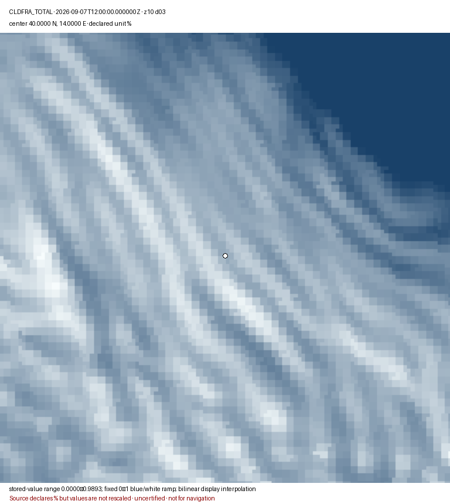

# Meteo@UniParthenope wind derivation

`wrf5_20260907Z1200_z10_wind_40N_14E.png` is a reproducible display derivation from the numeric `U10M` and `V10M` arrays in `data/meteouniparthenope/weather-tiles/2026/09/07/wrf5_20260907Z1200.mbtiles`. The current source container SHA-256 is `d0fc953116faf8bbe853fc957c91edb579de1fba6ce034cf1c3d70bfbdce1931`; the PNG SHA-256 is `6819b91848ea88829c8fd8932ae7cbe95e284359dc141a0561217c43def2c8d9`.

The renderer decodes DNT1 dtype, shape, byte order, compression, nodata, scale, offset, and unit. It computes speed as `sqrt(U10M² + V10M²)`, maps the finite speed range 1.3504–3.1448 m s-1 linearly from blue to yellow, applies bilinear interpolation only to the displayed RGB field, and overlays regularly subsampled unit-direction arrows. The 768 × 768 map area is centred on 40° N, 14° E at Web Mercator zoom 10. The white marker identifies that centre. The display is an uncertified model visualization and is not for navigation.

```bash
PYTHONPATH=src python utils/render_meteouniparthenope_wind.py \
  data/meteouniparthenope/weather-tiles/2026/09/07/wrf5_20260907Z1200.mbtiles \
  docs/images/meteo/wrf5_20260907Z1200_z10_wind_40N_14E.png \
  --zoom 10 --lat 40 --lon 14 --product wrf5 --domain d03 \
  --valid-time 2026-09-07T12:00:00.000000Z
```

## Total cloud fraction

`wrf5_20260907Z1200_z10_cldfra_total_40N_14E.png` is derived from the
`CLDFRA_TOTAL` DNT1 coordinate set in the same container. Its SHA-256 is
`b5be793956be6fd322b5d15478d403b92a94f82e908e217347bf683490be79e9`.
The renderer applies DNT1 scale and offset, excludes nodata/non-finite samples,
uses a fixed 0–1 blue-to-white ramp, and applies bilinear interpolation only to
the displayed RGB pixels. The stored values in the 768 × 768 zoom-10 view
centred on 40° N, 14° E range from 0.0000 to 0.9893. Although the source unit
attribute is `%`, the values appear fraction-like; the derivation records this
ambiguity and MUST NOT silently multiply the values by 100. No scientific
validation of the producer's unit/value consistency has been performed.

```bash
PYTHONPATH=src python utils/render_meteouniparthenope_cloud.py \
  data/meteouniparthenope/weather-tiles/2026/09/07/wrf5_20260907Z1200.mbtiles \
  docs/images/meteo/wrf5_20260907Z1200_z10_cldfra_total_40N_14E.png \
  --zoom 10 --lat 40 --lon 14 --product wrf5 --domain d03 \
  --valid-time 2026-09-07T12:00:00.000000Z
```


