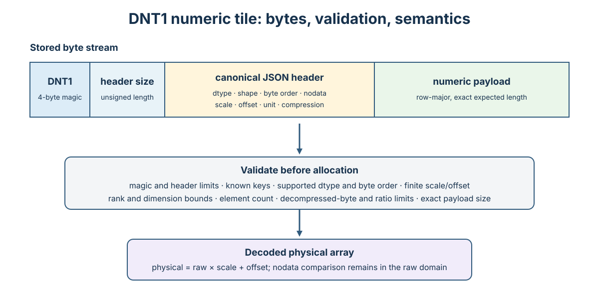

# DNT1 numeric tiles

DNT1 stores a rectangular numeric array as data, not as a rendered picture. It is appropriate for bathymetry, elevation, forecast fields, probabilities, masks, and other scientific coverages.



*Figure 1. Schematic DNT1 field sequence and defensive decoding flow. Field widths are not proportional; `specification.md` defines the normative byte layout and limits.*

```python
from datatiles import encode_numeric_tile, decode_numeric_tile

blob = encode_numeric_tile(
    [283.1, 283.4, 282.9, 283.0],
    shape=(2, 2), dtype="float32", unit="K", nodata=-9999.0
)
tile = decode_numeric_tile(blob)
```

The stored physical value is `raw * scale + offset`; `nodata` is compared in the raw domain. Payload shape is row-major. Supported dtypes are `int8`, `uint8`, `int16`, `uint16`, `int32`, `uint32`, `int64`, `uint64`, `float32`, and `float64`. Compression is either `none` or zlib.

The format is deliberately simple and dependency-free. It does not pretend to replace NetCDF, HDF5, Zarr, GeoTIFF, or CoverageJSON; it defines the self-contained payload of one Data Tile.

Decoders must regard every header field as untrusted. They should cap header length, rank, dimension sizes, element count, decompressed bytes, and compression ratio before allocation; verify that the payload length exactly matches dtype and shape; reject unknown keys when strict conformance is requested; and never return non-finite scale or offset values as valid physical semantics. Numeric interpretation must retain the declared unit, nodata comparison in the raw domain, scale, offset, byte order, and row-major ordering.
