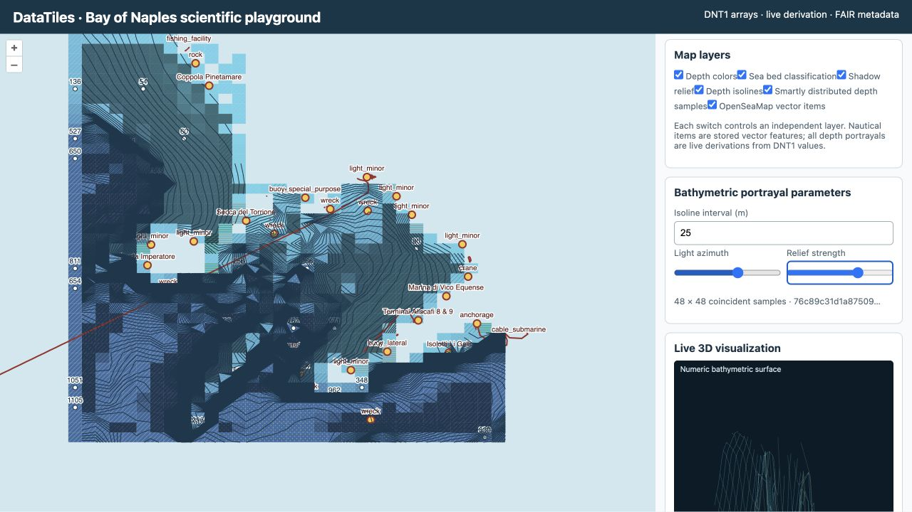
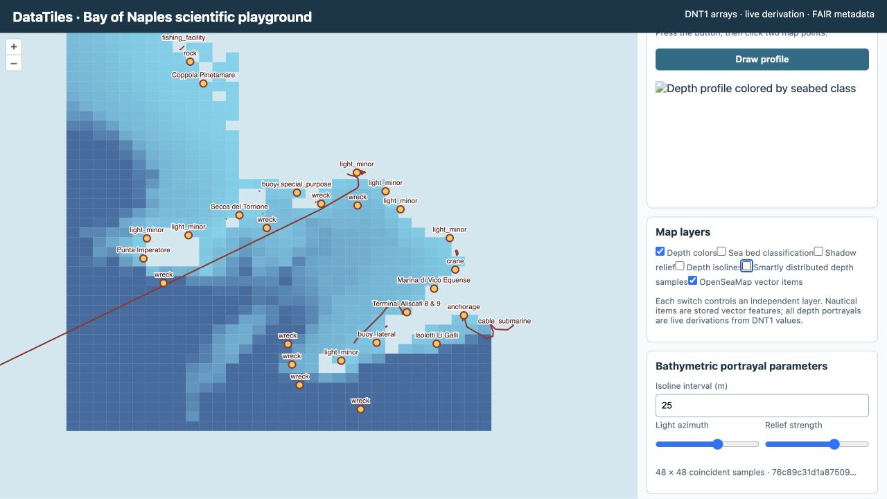
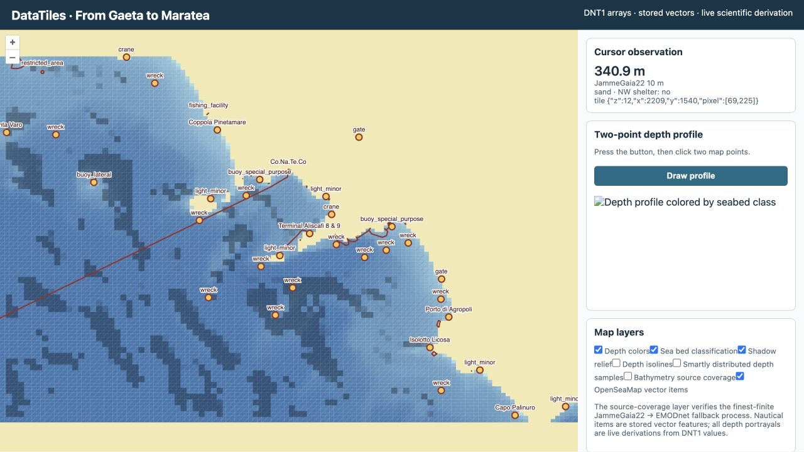
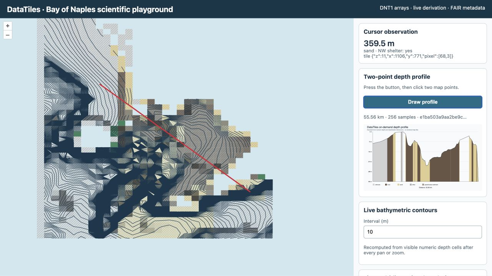
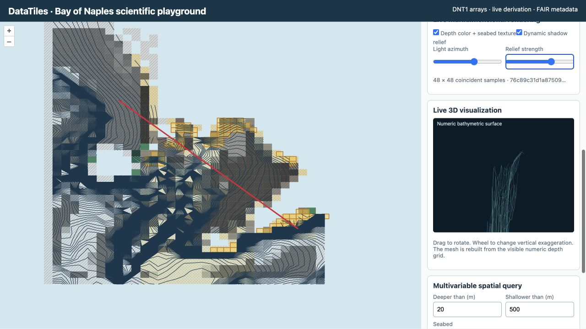
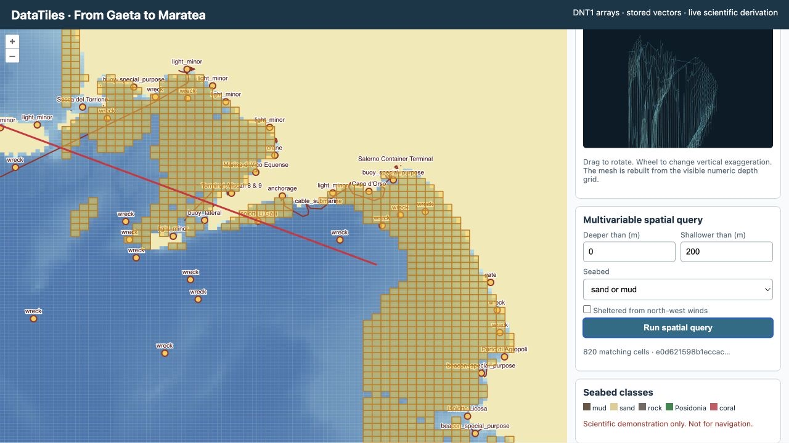
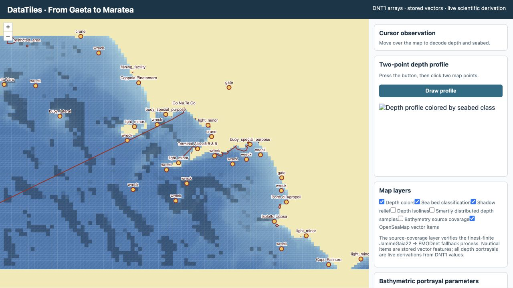
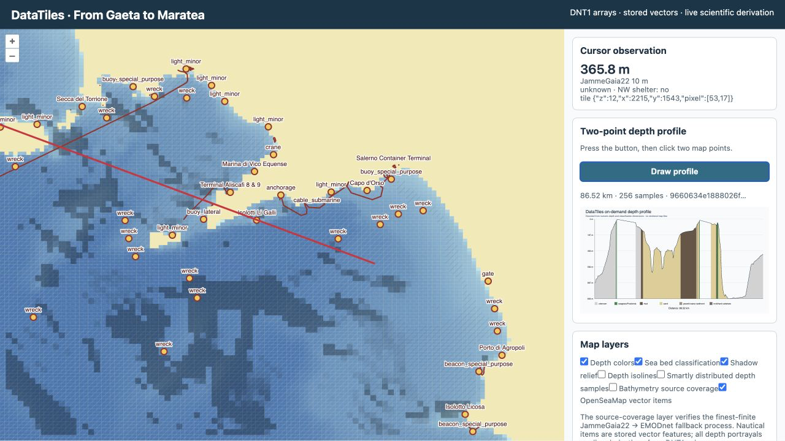

# OpenLayers scientific playground

The playground at `/playground` is a thin OpenLayers 10.10 client over DataTiles analysis resources. It deliberately contains no pre-rendered bathymetric chart. Its colored cells, depth samples, cursor values, profiles, isolines, query matches, shadow relief, textured seabed, and 3D surface are derived after the request from DNT1 arrays. Nautical items are a separate stored tiled-GeoJSON vector coordinate set.

The map demonstrates several independent operations. Pointer movement requests coincident depth, seabed class, and optional north-west shelter values with tile/pixel evidence. A two-click line requests the depth profile and colors it by seabed class. Map movement requests marching-squares contours, a depth/class surface, dynamic shadow relief, independently switchable depth color and classification texture, smart depth labels, a 3D mesh, and stored nautical vectors for the current WGS 84 extent. The query control evaluates a conjunction such as `5 < depth < 10`, `class ∈ {sand,mud}`, and—when the variable exists—`northwest_wind_shelter = true`, returning analysis-cell polygons as GeoJSON.

## Independent map layers

The layer panel can show or hide depth colors, seabed classification, shadow relief, depth isolines, smartly distributed depth samples, bathymetry source coverage, and OpenSeaMap vector items independently. Depth colors, classification patterns, relief, isolines, and samples are portrayals derived from decoded numeric/categorical arrays. Source coverage is a categorical verification view of the stored JammeGaia22/EMODnet selection result. The map requests a bounded 128 × 128 depth/class portrayal and a separate 96 × 72 coincident analytic surface. The smart-sample algorithm partitions the latter into deterministic 12 × 12 blocks, prioritizes the shallowest valid cell at or above the 50 m shallow-water threshold, and otherwise selects the cell with the greatest summed absolute difference from its cardinal neighbours. This emphasizes useful shallow context and locally informative gradients without claiming that selected labels are new measurements.

Adaptive contours use the selected shallow interval from the minimum valid depth through 50 m, `max(10 m, 2 × interval)` through 200 m, and `max(50 m, 10 × interval)` in deeper water. Minor, index, and major contours have different weights; only index and major contours receive labels. This avoids the deep-water line saturation visible with a uniform interval while retaining shallow detail. The algorithm remains marching squares over nearest-cell DNT1 samples, so visual refinement does not imply accuracy beyond the EMODnet source grid.

“OpenSeaMap vector items” means OpenStreetMap features carrying `seamark:*` tags, which are used by the OpenSeaMap rendering ecosystem. Acquisition uses a bounded Overpass query, locks the exact JSON response by SHA-256, retains only seamark/name/reference properties, converts nodes and ways deterministically to CRS84 GeoJSON, and tiles that feature collection into the `variable=openseamap_items` coordinate set. The server reads these features from DataTiles through `/collections/{id}/nautical-items`; it does not request OpenSeaMap raster tiles. Data copyright remains with OpenStreetMap contributors under ODbL 1.0. These community-maintained features are incomplete and unsuitable for navigation.

*Figure 1. Executed combined-layer use case with all seven switches enabled, 20 m shallow isolines, smart gradient-selected depth labels, source coverage, 225° illumination, and relief strength 6. The nautical symbols come from stored GeoJSON; the remaining map layers are derived from DNT1 arrays.*

*Figure 2. Executed isolation use case with depth color retained for spatial context and seabed classification, relief, isolines, and smart samples disabled. The visible seamark symbols and line features are read from `variable=openseamap_items`, not a remote chart portrayal.*

*Figure 3. Cursor inspection decodes coincident DNT1 values and reports the spatial tile and pixel used. The displayed values belong to the executed demonstration recorded in the [screenshot provenance register](images/demo/README.md); they are not a navigational sounding.*

*Figure 4. An 86.52 km, 256-sample profile and its red map transect. Depth and class are sampled from coincident numeric tiles; the profile is generated on demand and identified by its canonical checksum.*

The shelter layer is a derived, reproducible exposure proxy: a water cell is true when a ray toward the north-west intersects a land/nodata cell within the configured reach. It does not incorporate terrain height, fetch beyond the source domain, wind speed, diffraction, wave transformation, or temporal meteorology. The UI and provenance therefore label it as an analytical proxy, never as a navigational or safety determination.

## Live surface demonstrations

The `surface` resource returns a bounded, north-to-south regular grid containing coincident `depth_m`, `seafloor_class`, `bathymetry_source`, and boolean `northwest_wind_shelter` arrays, its geographic bounding box, sampling zoom, legends, and a canonical SHA-256 digest. Width and height are limited to 8–128 cells. The response is an analysis view, not a new storage encoding and not a rendered image.

Shadow relief estimates the local depth gradient with centered finite differences. The browser projects this gradient toward the chosen illumination azimuth and converts the result to a bounded translucent shadow field. Panning, zooming, azimuth changes, and relief-strength changes cause a new derivation. It is a visual terrain cue, not an estimate of solar irradiance.

Depth color and seabed texture deliberately encode different variables and occupy separate layers. Blue luminance varies with depth, while deterministic hatch, dot, and line patterns vary with seabed class. They may be inspected together or independently.

The 3D view projects the returned depth matrix into a rotatable wireframe. Pointer dragging changes azimuth and tilt; the wheel changes vertical exaggeration. These are view parameters only and do not mutate scientific values. The canvas label, response checksum, and source declaration make the transformation auditable.

*Figure 5. Executed live-surface use case with a 20 m shallow contour interval, 225° illumination, relief strength 6, and a rotated numeric mesh. These are portrayal parameters over stored values, not new scientific variables.*

*Figure 6. Compound query for `0 < depth < 200` m and sand or mud, without the optional shelter predicate. The 820 highlighted cells are a derived GeoJSON analysis result.*

The rendering pipeline is therefore `DNT1 arrays → sampled numeric surface → client-side analytical representation`. Implementations must not cache a representation in a way that obscures the dataset checksum and parameter set from which it was derived.

*Figure 7. Executed widened-corridor overview from checksum-locked inputs. The wide-area EMODnet, thematic, and OSM subsets were reacquired because the older regional snapshots did not contain the western islands. The isoline layer starts hidden at this scale to prevent contour density from overstating source resolution.*

*Figure 8. Executed 86.52 km, 256-sample profile with its red map transect and derived SVG chart. Stored seamark vectors remain visually and semantically separate from numeric depth derivations.*

*Figure 9. Executed `0 < depth < 200` m and sand-or-mud query with 820 highlighted analysis cells. The result is a request-time GeoJSON derivation and not a stored portrayal.*

For development, build the demo, run `datatiles-serve work/gaeta-to-maratea.datatiles --port 8080`, and visit `http://127.0.0.1:8080/playground`. The OpenLayers dependency is version-pinned. A production deployment should self-host the pinned asset, apply CSP and request rate limits, cache derived responses by canonical query plus dataset checksum, and execute expensive processing through a bounded worker service.

## FAIR evidence panel

The live playground now exposes the container's principle-level FAIR report and rights-record count, with machine-readable `/fair`, `/rights`, `/provenance`, and `/datacite` resources. This is intentionally adjacent to the scientific visualization: a user must be able to inspect lineage and reuse conditions without leaving the object. The panel never converts FAIRness into a safety or scientific-validity badge. Static exports embed the same rights, PROV, DataCite candidate metadata, primary identifier and FAIR report in `data/manifest.json`.

## Cryptographic integrity evidence

The playground may display the number of recorded signature records via `/integrity`. This is disclosure, not verification or trust. Full manifest computation is available explicitly at `/integrity/manifest` because it can require reading every scientific tile. Private-key signing is intentionally absent from the HTTP service.

## Commercial/DRM disclosure

An authorized plaintext playground may expose non-secret commercial product metadata and ODRL policy. A public storefront/demo should disclose product identity, issuer, terms URI, access status, and required source acknowledgements without exposing protected scientific payloads or key material. DRM status is not a safety or quality badge.
