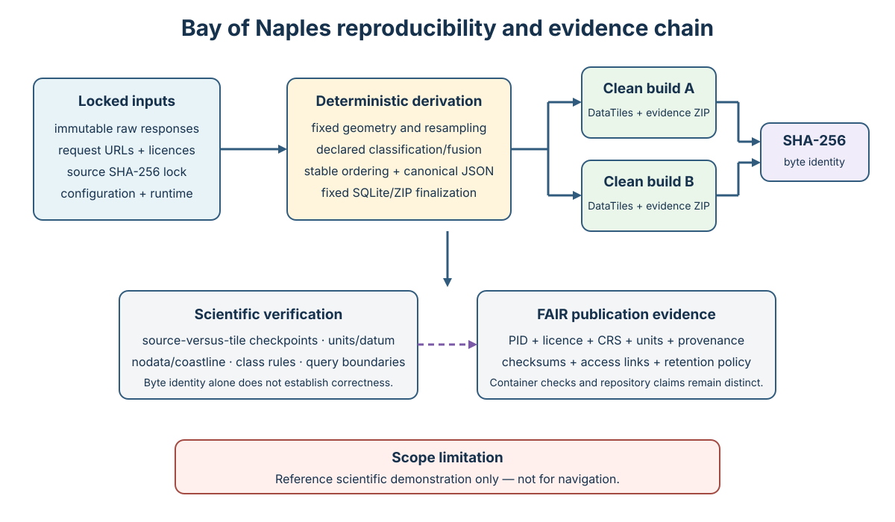

# Reproducing the Bay of Naples demonstration

## Claim and scope

This protocol reconstructs the Bay of Naples DataTiles object from the exact input bytes, canonical configuration, and locked runtime. Success means that the resulting SQLite file and evidence ZIP have the recorded SHA-256 values. Reacquiring nominally identical data from mutable network services is a *replication* unless the acquired bytes match the source lock.

The demonstration integrates EMODnet DTM 2024 bathymetry, EMODnet Geology seabed substrate, and EUSeaMap 2025 habitat data. It emits continuous depth, source substrate, source habitat, fused seafloor class, and a derived north-west land-interception shelter proxy. It is a scientific software demonstration and must not be used for navigation.



*Figure 1. Exact reconstruction couples immutable inputs and runtime/configuration locks to deterministic derivation and byte-identity checks. Scientific verification and FAIR publication evidence are separate obligations; none of these checks makes the demonstration suitable for navigation.*

## Prerequisites

- a POSIX-like environment with `make`;
- the exact Python version in `runtime-lock.json`;
- SQLite and zlib versions matching that lock;
- Python dependencies in `requirements-demo.lock`;
- sufficient storage for retained raw responses and the evidence ZIP;
- network access to the service URLs in `config.json` for first acquisition.

Use an isolated environment. From the project root:

```bash
python -m venv .venv
. .venv/bin/activate
python -m pip install --upgrade pip
python -m pip install -e '.[demo,test]'
python -c 'from datatiles.demo import runtime_versions; print(runtime_versions())'
```

Compare the printed object with `demo/bay-of-naples/runtime-lock.json`. The build intentionally stops on a difference because SQLite, zlib, or library variation can change container bytes even when decoded values agree.

## Step-by-step execution in `data/`

The following procedure keeps downloads, the isolated environment, generated containers, and use-case outputs under the ignored repository-local `data/directory/`. It MUST NOT overwrite the tracked configuration or retained runtime lock.

### 1. Prepare an isolated workspace

From the repository root:

```bash
mkdir -p data/directory
cp demo/bay-of-naples/config.json data/directory/config.json
cp demo/bay-of-naples/runtime-lock.json data/directory/runtime-lock.json
python3.12 -m venv data/directory/.venv
data/directory/.venv/bin/python -m pip install --upgrade pip
data/directory/.venv/bin/python -m pip install -e '.[demo,test]'
```

The copied configuration remains checksum-identical to the tracked configuration. Keeping the runtime lock beside it is required because the pipeline resolves `runtime-lock.json` relative to `--config`.

### 2. Enforce or explicitly delimit the runtime claim

Inspect the active runtime before acquisition:

```bash
data/directory/.venv/bin/python -c \
  'from datatiles.demo import runtime_versions; print(runtime_versions())'
diff -u demo/bay-of-naples/runtime-lock.json data/directory/runtime-lock.json
```

For an exact reconstruction claim, the active versions MUST equal the retained lock. Stop when they differ; do not edit the tracked lock merely to make the gate pass.

For a host-specific demonstration build only, replace the copied lock—never the tracked lock—with an explicit record of the active environment:

```bash
data/directory/.venv/bin/python -c \
  "from pathlib import Path; from datatiles.demo import runtime_versions,write_json; write_json(Path('data/directory/runtime-lock.json'),runtime_versions())"
```

Such a run can verify internal checksums and byte identity across repeated builds on that host, but it is not the retained reference-runtime reconstruction. Its manifest and documentation MUST identify the actual runtime.

### 3. Acquire and review immutable inputs

```bash
data/directory/.venv/bin/python -m datatiles.demo acquire \
  --config data/directory/config.json \
  --work data/directory/work
```

If the Python installation lacks a usable CA bundle, install `certifi` in the acquisition environment and set `SSL_CERT_FILE` to the path printed by `python -m certifi`; TLS verification MUST NOT be disabled.

Before building, inspect:

```bash
find data/directory/work/raw -type f -maxdepth 1 -print
data/directory/.venv/bin/python -m json.tool data/directory/work/source-lock.json
data/directory/.venv/bin/python -m json.tool data/directory/work/acquisition-report.json
```

Confirm response types, catalogue identifiers, releases, licences, request URLs, sizes, and SHA-256 values. Archive the accepted `source-lock.json`. Live-service responses remain mutable even when their URLs do not change.

### 4. Build and verify the DataTiles object

```bash
data/directory/.venv/bin/python -m datatiles.demo build \
  --config data/directory/config.json \
  --work data/directory/work
data/directory/.venv/bin/python -m datatiles.demo verify \
  --config data/directory/config.json \
  --work data/directory/work
```

Review `artifact-manifest.json`, `bathymetry-preview.png`, and `seafloor-class-preview.png`. The previews are deterministic QA portrayals, not stored scientific variables. The primary products are `bay-of-naples.datatiles` and `bay-of-naples-evidence.zip`.

### 5. Execute the double-build gate

```bash
shasum -a 256 \
  data/directory/work/bay-of-naples.datatiles \
  data/directory/work/bay-of-naples-evidence.zip \
  > data/directory/first-build.sha256

data/directory/.venv/bin/python -m datatiles.demo build \
  --config data/directory/config.json \
  --work data/directory/work
data/directory/.venv/bin/python -m datatiles.demo verify \
  --config data/directory/config.json \
  --work data/directory/work
shasum -a 256 -c data/directory/first-build.sha256
```

Both checks MUST report `OK`. A mismatch is pipeline drift and invalidates byte-identity claims until explained.

### 6. Run the local scientific playground

```bash
data/directory/.venv/bin/datatiles-serve \
  data/directory/work/bay-of-naples.datatiles \
  --host 127.0.0.1 --port 8080
```

Open `http://127.0.0.1:8080/playground`. Exercise cursor inspection, a two-point profile, contour interval changes, texture and hillshade toggles, illumination and relief controls, 3D rotation/exaggeration, and a compound depth/class/shelter query. The [executed screenshots and their provenance](images/demo/README.md) show representative results.

The browser URL MUST use `http://127.0.0.1:8080/playground`. Do not open `src/datatiles/profile-demo.html` directly: it is a server-side template containing a collection placeholder, and a `file://` page has no DataTiles API origin from which to load numeric arrays.

### 7. Retain machine-readable use-case evidence

```bash
mkdir -p data/directory/use-cases
curl -o data/directory/use-cases/profile.json \
  'http://127.0.0.1:8080/collections/bay-of-naples/profile?start=14.190,40.810&end=14.235,40.555&samples=256&f=json'
curl -o data/directory/use-cases/profile.csv \
  'http://127.0.0.1:8080/collections/bay-of-naples/profile?start=14.190,40.810&end=14.235,40.555&samples=256&f=csv'
curl -o data/directory/use-cases/fair.json \
  'http://127.0.0.1:8080/collections/bay-of-naples/fair'
curl -o data/directory/use-cases/surface.json \
  'http://127.0.0.1:8080/collections/bay-of-naples/surface?bbox=13.8,40.5,14.5,41.0&width=48&height=48'
```

Record the container checksum, source-lock checksum, runtime, request parameters, response checksums, test log, and screenshot hashes. The FAIR report distinguishes container checks from external publication obligations and MUST NOT be presented as an opaque certification score.

## First acquisition and review

```bash
cd demo/bay-of-naples
make acquire
```

Acquisition stores raw WCS/WFS/catalogue responses, the complete request URLs, sizes, and SHA-256 values under `work/`. Before accepting these bytes as a reference snapshot, inspect HTTP diagnostics, verify that TIFF and GeoJSON responses are complete, compare catalogue identifiers/releases with `config.json`, review licence terms, and archive the resulting `source-lock.json`. A lock is an evidence decision, not merely build output.

For controlled replay, place the accepted raw files in `work/raw/` with the accepted `work/source-lock.json`; do not contact live services. Build and verify:

```bash
make build
make verify
sha256sum work/bay-of-naples.datatiles work/bay-of-naples-evidence.zip
```

For reacquisition against an accepted lock, use the CLI’s `--expect-lock` option. Incoming bytes are downloaded separately and promoted only when every checksum matches. Differences are preserved as a new candidate snapshot and must not silently overwrite the reference.

## Deterministic transformation

The implementation fixes request geometry and raster dimensions; canonicalizes JSON; sorts vector features; uses deterministic polygon rasterization and class precedence; applies nearest-cell resampling for categorical grids; inserts tiles in stable zoom/column/row/variable order; vacuums SQLite; fixes ZIP timestamps and permissions; and records the runtime and configuration digests. Depth sign conversion is recorded in provenance. The north-west shelter proxy traces a finite north-west ray through the source water/land mask using the configured reach.

The evidence bundle contains configuration, runtime lock, source lock, manifest, DataTiles object, diagnostic previews, and all raw source responses. Tile-level provenance links derived cells to the source entities. The verifier checks source and output digests, database integrity and foreign keys, previews, and evidence-bundle integrity.

## Required reproducibility test

Run the test suite and require two clean builds from the same fixture to be byte-identical:

```bash
python -m pytest -q
```

For the retained EMODnet snapshot, delete only a safely marked `work/` directory using `make clean`, restore the evidence inputs, build twice, and compare both DataTiles and evidence ZIP SHA-256 values. Record the host, runtime report, commands, start/end times, checksums, and test log in the reproduction report.

## Scientific verification

Byte identity detects pipeline drift but does not establish scientific correctness. Independently inspect source-versus-tile values at stratified checkpoints, coastline/nodata alignment, depth distribution and units relative to Lowest Astronomical Tide, class crosswalk and precedence, per-class cell totals, profile endpoints, contour levels, and predicate-query boundary conditions. The shelter proxy must be assessed only against its declared land-interception semantics.

## Failure interpretation

A raw checksum difference indicates upstream revision or transport difference. A runtime mismatch invalidates the byte-identity claim until reproduced in the locked environment. An output checksum difference with identical inputs indicates nondeterminism or software drift. Identical bytes with failed scientific checks indicate a reproducible error and require a new dataset version—not alteration of the historical evidence bundle.
