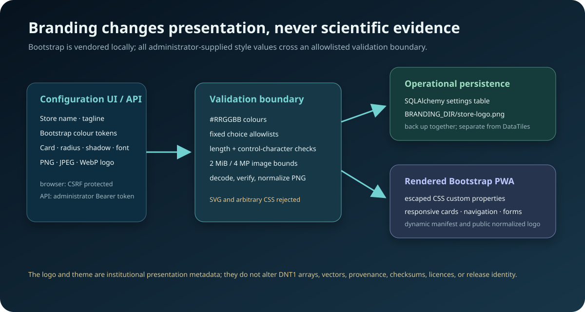

# Configuration

Administrators open **Configuration** in the PWA. Runtime branding, Bootstrap theme, identity, registration, SMTP, and public-URL settings are stored through SQLAlchemy and can also be managed through the authenticated `/api/v1/configuration` API.

Secret fields are write-only in the web/API representation: an existing client secret or SMTP password is not returned to browsers or API clients. Blank secret fields in the web form retain the existing value.

## Store identity and logo

`store.name` controls the navigation brand, catalog heading, page titles, footer, and PWA manifest. `store.tagline` supplies the short navigation/catalog description. The name is limited to 80 characters and the tagline to 180 characters; control characters are rejected.

Administrators MAY upload a PNG, JPEG, or WebP logo through the Branding card. The input MUST be no larger than 2 MiB, at least 16 × 16 pixels, and no more than 4 megapixels. The Store verifies the image, removes embedded metadata by decoding it, and writes a normalized PNG to `BRANDING_DIR`. SVG is intentionally rejected because active SVG content is inappropriate for an administrator-uploaded public asset. Logo bytes remain operational presentation state and MUST NOT be placed in a DataTiles scientific container.

API clients use `PUT /api/v1/configuration/logo` with multipart field `logo`, and `DELETE /api/v1/configuration/logo` to remove it. Both operations require an administrator Bearer token. `GET /branding/logo` is public because it forms part of the application shell.

## Bootstrap theme

The Store vendors Bootstrap 5.3.8 CSS and bundled JavaScript locally. It does not require a third-party CDN at runtime. Administrators can select primary, secondary, success, danger, warning and information colours; body, card and navigation backgrounds/text; border colour; card radius; shadow depth; and one of the bounded system, serif, or monospace font stacks.

Colour values MUST use six-digit hexadecimal form. Radius, shadow, and font values are selected from fixed allowlists. These constraints prevent runtime settings from becoming arbitrary CSS. Saved settings are emitted as escaped CSS custom properties that specialize Bootstrap components and the Store layout.

## Authentication controls

- `auth.local.enabled`: managed email/username and password authentication.
- `auth.registration.enabled`: permits new self-service accounts.
- `auth.registration.default_group`: group assigned to self-registered identities.
- Google, Microsoft, and generic OIDC settings enable infrastructure SSO.

At least one usable authentication method must remain enabled before an administrator signs out.

## Public base URL

Set `store.public_base_url` to the canonical HTTPS origin when the Store is behind a proxy. Verification emails and OIDC redirect URIs use this value. Register the resulting callback URIs with each identity provider.

## SMTP

Configure host, port, STARTTLS or implicit TLS, username/password, sender address/name, and timeout. Email verification requires SMTP to be enabled and operational. Use the SMTP test operation after changes.

## Commerce and PayPal
Payment is disabled by default. Administrators configure the provider and PayPal sandbox/live credentials in Configuration.
