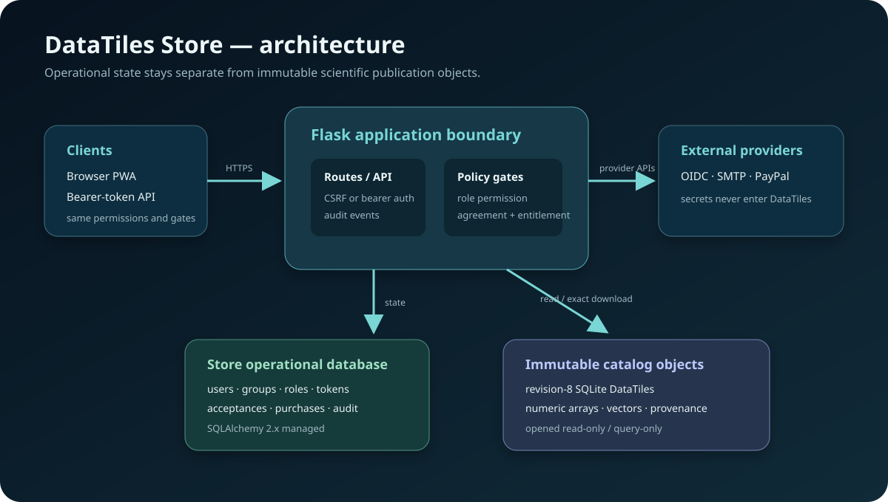
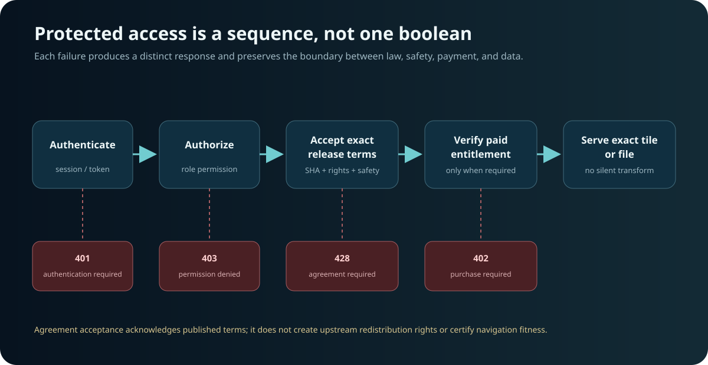
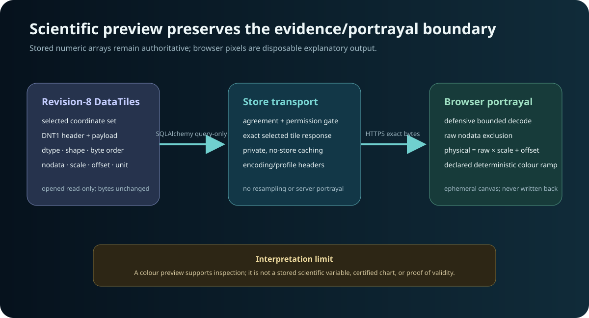
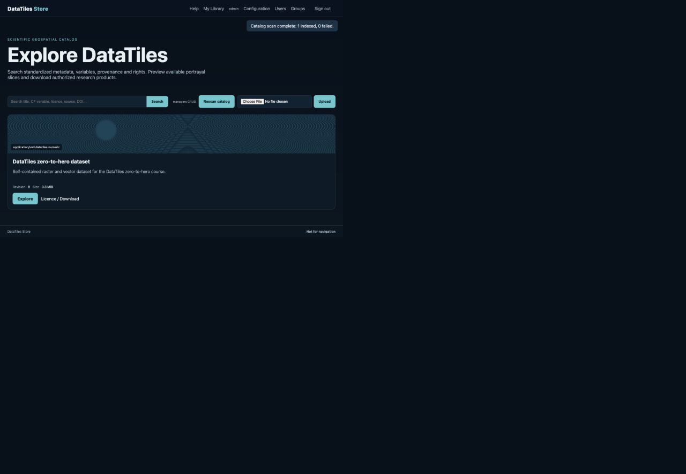
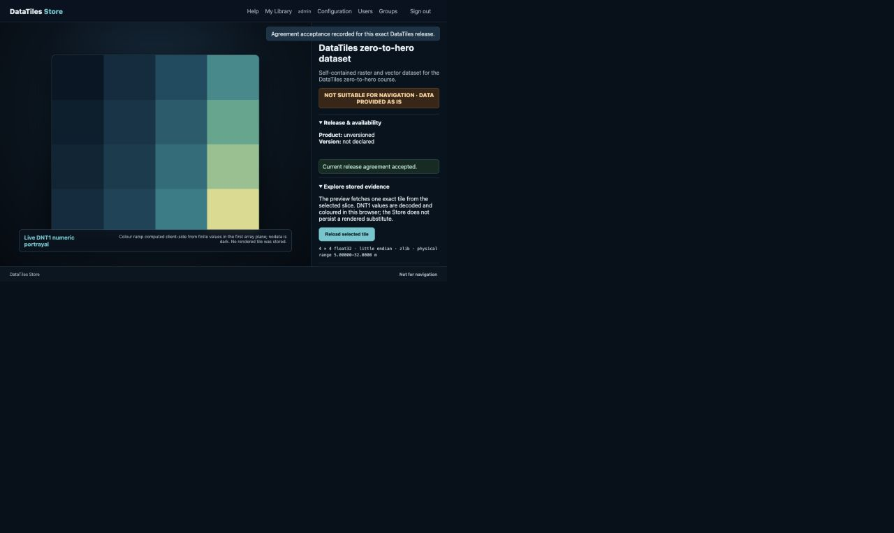
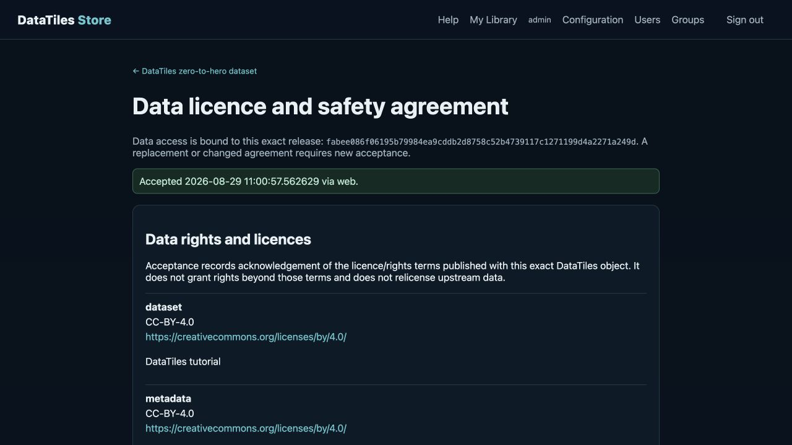

# Figures, screenshots, and visual provenance

The figures and screenshots in this directory explain the Store implementation; they are not stored scientific values, navigation products, evidence of OGC certification, or substitutes for tests. SVG sources are reviewable repository-native diagrams. JPEG screenshots were captured from a local Store reference instance on port 8080 using a generated revision-8 tutorial fixture, a temporary Store database/catalog, and a disposable development administrator account. No third-party basemap, external Store, or production account appears in them.

## Architecture figures

- `figures/store-architecture.svg` — Flask, SQLAlchemy operational state, immutable DataTiles files, clients, and external-provider trust boundaries. Authored as SVG from the implementation modules `app.py`, `db.py`, `security.py`, and `catalog.py`.
- `figures/access-gates.svg` — authentication, permission, exact-release agreement, optional entitlement, and data-serving sequence with distinct HTTP failure classes.
- `figures/client-side-preview.svg` — exact DNT1 transport and ephemeral browser portrayal boundary, including dtype/shape/byte-order/nodata/scale/offset/unit semantics.

## Verified reference screenshots

- `images/store-catalog.jpg` — authenticated catalog search and revision-8 product card after SQLAlchemy indexing.
- `images/store-scientific-preview.jpg` — exact selected DNT1 tile decoded into an ephemeral canvas portrayal; the on-screen legend states the algorithm and physical range.
- `images/store-agreement.jpg` — release-bound structured-rights and not-for-navigation acceptance status for the captured release.

The screenshot fixture is reproducible with the procedure in `installation.md`. Recapture after a material UI or policy change and rerun the documentation visual register test. Screenshot pixels are presentation evidence only; scientific verification continues to use the fixture DataTiles values and automated API tests.
