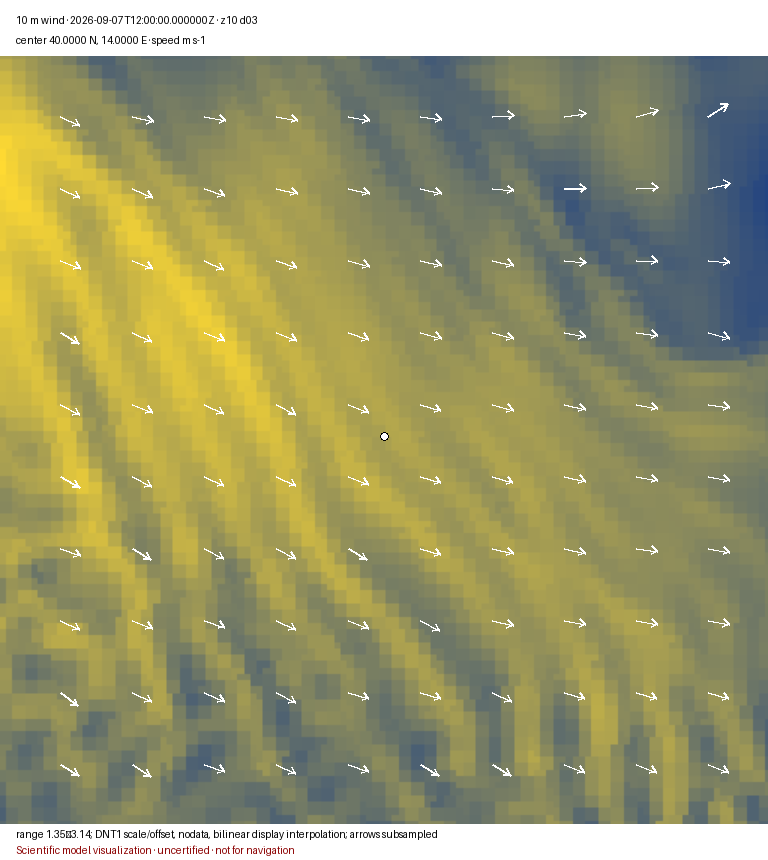

# DataTiles import utilities

`netcdf2datatiles.py`, `grib2datatiles.py`, and `zarr2datatiles.py` convert scientific source grids into DNT1 numeric DataTiles. They deliberately do **not** pre-render PNG/JPEG/WebP map imagery.

The scientific-grid commands accept either a local path, a `file:` URI, or an HTTP(S) URL. HTTP(S) input is downloaded to a temporary seekable file, SHA-256 hashed, imported, and deleted. The original URL and checksum are retained as DataTiles source/provenance metadata.

The first implementation targets rectilinear one-dimensional latitude/longitude grids. It resamples to Web Mercator tile pixel centers using nearest-neighbour sampling and stores rows through the DataTiles XYZ interface, which converts them to MBTiles/TMS storage. Curvilinear grids, rotated poles, projected source grids, conservative remapping, and antimeridian-spanning imports must use a future specialized resampling path rather than being silently approximated.

## Python environment setup

The utilities require Python 3.10 or newer. Create a dedicated virtual
environment from the repository root so that the optional scientific I/O
dependencies do not become dependencies of the core `datatiles` package:

```bash
python3 -m venv .venv
.venv/bin/python -m pip install --upgrade pip
.venv/bin/python -m pip install -e '.[utils]'
```

On Windows PowerShell, activate the same environment with:

```powershell
.venv\Scripts\Activate.ps1
python -m pip install --upgrade pip
python -m pip install -e ".[utils]"
```

Verify the virtual-environment installation before running an import:

```bash
.venv/bin/python -c "import datatiles, numpy, xarray, netCDF4, cfgrib, zarr, fsspec; print('DataTiles utility environment ready')"
.venv/bin/python utils/netcdf2datatiles.py --help
.venv/bin/python utils/grib2datatiles.py --help
.venv/bin/python utils/zarr2datatiles.py --help
```

The commands below invoke `.venv/bin/python` explicitly and therefore do not
depend on shell activation. On Windows, use `.venv\Scripts\python.exe` in its
place. GRIB support also requires the ecCodes native library used by `eccodes`/`cfgrib`;
if the verification command cannot load ecCodes, install it using the package
manager documented for the operating system before retrying. Environment
creation and dependency installation require network access unless the needed
packages are already available from a local package cache.

To run the complete repository test suite in the same environment, include the
test, integrity, and DRM extras, then run the required checks from the
repository root:

```bash
.venv/bin/python -m pip install -e '.[utils,test,integrity,drm]'
.venv/bin/python -m compileall src tests
.venv/bin/python -m pytest
```

NetCDF example:

```bash
.venv/bin/python utils/netcdf2datatiles.py ./ocean.nc ocean.datatiles \
  --variable depth --zoom 7 --bbox 12.8 39.9 15.8 41.3 \
  --source-license CC-BY-4.0 --source-license-uri https://creativecommons.org/licenses/by/4.0/ \
  --source-attribution "Required source credit" \
  --dataset-license CC-BY-4.0 --dataset-license-uri https://creativecommons.org/licenses/by/4.0/
```

URL example:

```bash
.venv/bin/python utils/netcdf2datatiles.py \
  https://example.org/data/ocean.nc ocean.datatiles --variable depth \
  --source-license LicenseRef-Source-Terms --source-license-uri https://example.org/terms \
  --source-attribution "Required source credit" \
  --dataset-license LicenseRef-Output-Terms --dataset-license-uri https://example.org/output-terms
```

GRIB2 example:

```bash
.venv/bin/python utils/grib2datatiles.py ./forecast.grib2 weather.datatiles \
  --variable t2m --zoom 6 \
  --source-license LicenseRef-Provider-Terms --source-license-uri https://example.org/model-terms \
  --source-attribution "Required model-provider credit" \
  --dataset-license LicenseRef-Derived-Terms --dataset-license-uri https://example.org/derived-terms
```

When one GRIB file contains incompatible hypercubes, use repeatable cfgrib filters:

```bash
.venv/bin/python utils/grib2datatiles.py forecast.grib2 pressure.datatiles \
  --filter-by-keys typeOfLevel=isobaricInhPa --variable t
```

Important constraints:

- The utilities are optional import tooling; `datatiles` core remains dependency-free.
- NetCDF semantic identity comes from `standard_name` when present; otherwise the local variable is registered under the non-CF `source` vocabulary.
- GRIB import preserves the decoded CF name where available and adds WMO GRIB2 discipline/category/parameter and GRIB short-name identifiers when exposed by cfgrib.
- Inputs without a CF name are never falsely labelled as CF.
- Output uses `application/vnd.datatiles.numeric` + DNT1; portrayal is a downstream reproducible derivation.
- `--max-tiles` is an intentional resource guard.
- The guard counts every variable and every non-spatial slice, not merely one spatial pyramid per variable.
- The first variable/slice in deterministic input order becomes the selected MBTiles compatibility slice; numeric bytes remain DNT1 and are never relabelled as portrayal imagery.

## Zarr

Local directory store:

```bash
.venv/bin/python utils/zarr2datatiles.py ./ocean.zarr ocean.datatiles \
  --variable depth --zoom 7 \
  --source-license CC-BY-4.0 --source-license-uri https://creativecommons.org/licenses/by/4.0/ \
  --source-attribution "Required source attribution" \
  --dataset-license CC-BY-4.0 --dataset-license-uri https://creativecommons.org/licenses/by/4.0/
```

Remote store:

```bash
.venv/bin/python utils/zarr2datatiles.py https://example.org/ocean.zarr ocean.datatiles \
  --source-sha256 <authoritative-immutable-store-sha256> \
  --variable depth --zoom 7 \
  --source-license CC-BY-4.0 --source-license-uri https://creativecommons.org/licenses/by/4.0/ \
  --source-attribution "Required source attribution" \
  --dataset-license CC-BY-4.0 --dataset-license-uri https://creativecommons.org/licenses/by/4.0/
```

Zarr stores are multi-object datasets. Local stores use the documented `zarr-tree-sha256-v1` canonical store digest. Remote stores require an externally established SHA-256 for the immutable store/snapshot instead of pretending that a directory URL has single-file bytes. `--group`, `--zarr-format {2,3}`, `--consolidated {auto,true,false}`, and repeatable `--storage-option KEY=VALUE` are supported. Secret storage-option values are never recorded in provenance. Signed or credential-bearing remote URLs require `--provenance-uri` with a stable credential-free identifier. See `docs/zarr-source-profile.md`.

## Digital signatures

Converters do not accept private signing keys and do not auto-sign outputs. Cryptographic signing is a release operation, not an ingestion operation. After the final DataTiles object has passed scientific QA, provenance, citation, rights, and FAIR checks, use `datatiles-integrity sign`. This separation reduces private-key exposure and ensures the signature covers the final immutable release state.

## Commercial DRM

Import utilities intentionally contain no DRM keys and no licence issuance logic. After a lawful final product is frozen and optionally signed, use `datatiles-drm protect` and `datatiles-drm issue-license`. This keeps source acquisition reproducible and keeps commercial secrets out of scientific ingestion workflows.

## Meteo@UniParthenope archive importer

`meteouniparthenope2datatiles.py` imports Meteo@UniParthenope NetCDF frames.
Source basenames MUST
have this form:

```text
<prod>_<domain>_<YYYYMMDD>Z<hhmm>.nc
```

`prod` MUST be one of `wrf5`, `ww33`, `rms3`, `wcm3`, or `aiq3`; `domain` MUST
be one of `d01`, `d02`, or `d03`. Availability of a product/domain pair is a
property of the upstream archive and is not inferred by the utility. The
filename instant MUST equal the single decoded NetCDF `time` coordinate.

The regular archive URL is:

```text
https://data.meteo.uniparthenope.it/files/<prod>/<domain>/archive/<YYYY>/<MM>/<DD>/<prod>_<domain>_<YYYYMMDD>Z<hhmm>.nc
```

For example, a downloaded file, a `file:` URI, and an ordinary HTTPS resource
are accepted by the same command:

```bash
.venv/bin/python utils/meteouniparthenope2datatiles.py \
  'data/meteouniparthenope/files/*.nc' \
  --root ./data/meteouniparthenope/weather-tiles --zoom 6,18 \
  --variables U10,V10,T2C,SLP,RH2,DELTA_RAIN \
  --source-license LicenseRef-MeteoUniParthenope-Terms \
  --source-license-uri https://www.meteo.uniparthenope.it/ \
  --source-attribution "Meteo@UniParthenope" \
  --dataset-license LicenseRef-MeteoUniParthenope-Derived
```

In this provider-specific profile, an omitted `--dataset-license-uri` defaults
to `--source-license-uri`. Supply it explicitly whenever the derived-dataset
terms have a distinct URI. This convenience does not infer that the source and
derived licences are legally equivalent: their separate expressions remain
mandatory and the operator remains responsible for selecting the applicable
terms.

The utility expands quoted local globs itself. `--variables` accepts a
comma-separated list; repeatable `--variable` remains supported. `U10` and
`V10` are compatibility aliases for `U10M` and `V10M`. Variables unavailable
in a product are skipped; the importer does not manufacture WRF variables in
wave products.

`--zoom MIN,MAX` denotes every integer zoom in the inclusive range. For each
product/frame, the importer reads the available domains' coordinate arrays,
computes their median rectilinear cell resolution, and selects a coarse-to-fine
domain for every zoom. Zoom 6 is the declared coarse-domain reference; finer
transition zooms are derived from base-2 resolution ratios. Each zoom uses the
selected domain's measured extent. The mapping is recorded in
`datatiles:meteouniparthenope_domain_selection`; no silent domain fusion occurs.

By default this writes one file per product and valid-time frame:

```text
./data/meteouniparthenope/weather-tiles/2026/09/07/wrf5_20260907Z1200.mbtiles
```

The naming rule is `<prod>_<YYYY><MM><DD>Z<hh><mm>.mbtiles`. Use
`--frame-storage single` to place all requested products and valid times in
`<root>/meteouniparthenope.mbtiles`. High zooms over a complete domain can
create millions of tiles; `--max-tiles` deliberately requires the operator to
acknowledge that expansion or constrain it with `--bbox`.

Use `--opendap` when every supplied HTTP(S) source is an OPeNDAP dataset URL.
The utility materializes the retrieved dataset as a temporary NetCDF snapshot,
hashes that exact snapshot, records the original OPeNDAP URL and acquisition
mode as provenance, and deletes the temporary file. An ordinary HTTP(S) NetCDF
resource is instead hashed as downloaded file bytes. A local file is hashed in
place. Public transport access MUST NOT be interpreted as permission to use or
redistribute the data; the operator MUST supply the applicable source and
derived-dataset rights arguments.

Each numeric slice is addressed by `variable`, `product`, `domain`, and
`valid_time`, plus any additional non-spatial source dimensions. Variables are
registered under the producer-local `MeteoUniParthenope` vocabulary because
the source metadata is not assumed to contain authoritative CF Standard Names.
Rectilinear latitude/longitude values are resampled to Web Mercator tile pixel
centres with explicitly recorded nearest-neighbour sampling. Values remain
DNT1 numeric arrays; the utility does not create or store portrayal imagery.

The verified wind example below is derived from stored zoom-10 `U10M` and
`V10M` arrays, centred on 40° N, 14° E. Its exact input, algorithm, parameters,
checksums, and reproduction command are in the [image register](../docs/images/meteo/README.md).



The same import includes `CLDFRA_TOTAL`. The verified scalar output below uses
a fixed 0–1 display ramp without altering the stored values. The producer
declares `%`, while the observed stored range is fraction-like; this unresolved
unit/value ambiguity is stated in the [image register](../docs/images/meteo/README.md).


